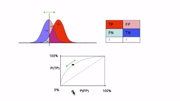
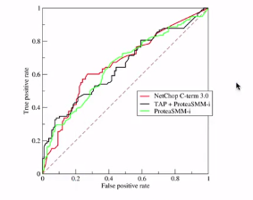
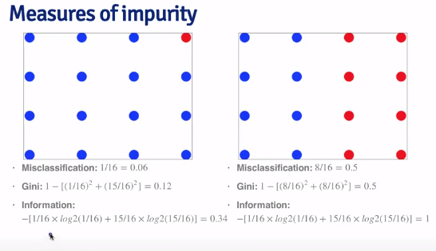

## Table of Contents

* [Assignment](#PA)
* [Week 1](#Lectures1)
* [Week 2](#Lectures2)
* [Week 3](#Lectures3)
* [Quizzes](#Quizzes)
* [Homeworks](#HW)

<a id="PA">Peer Assessment:</a>

###Write up

**Background**

In this project, your goal will be to use data from accelerometers on the belt, forearm, arm and dumbbell of 6 participants. They were asked to perform barbell lifts correctly and incorrectly in 5 different ways.  More information is available at: <a href="http://groupware.les.inf.puc-rio.br/har">here</a> (see the section on the Weight Lifting Exercise Dataset).

**Data**

The training data for this project are available here:

<a href="https://d396qusza40orc.cloudfront.net/predmachlearn/pml-training.csv">https://d396qusza40orc.cloudfront.net/predmachlearn/pml-training.csv</a>

The test data are available here:

<a href="https://d396qusza40orc.cloudfront.net/predmachlearn/pml-testing.csv">https://d396qusza40orc.cloudfront.net/predmachlearn/pml-testing.csv</a>

The data for this project come from this source: http://groupware.les.inf.puc-rio.br/har. If you use the document you create for this class for any purpose please cite them as they have been very generous in allowing their data to be used for this kind of assignment. 

**What you should submit**

The goal of your project is to predict the manner in which they did the exercise.  This is the "classe" variable in the training set.  You may use any of the other variables to predict with. You should create a report describing

* How you built your model
* How you used cross validation
* what you think the expected out of sample error is
* and why you made the choices you did

You will also use your prediction model to predict 20 different test cases.

1.  Your submission should consist of a link to a Github repo with your R markdown and compiled HTML file describing your analysis. Please constrain the text of the writeup to < 2000 words and the number of figures to < 5.  It will make it easier for the graders if you submit a repo with a gh-pages branch so the HTML page can be viewed online.
2.  You should also apply your machine learning algorithm to the 20 test cases available in the test data above.  Please submit your predictions in appropriate format to the programming assignment for automated grading.

**Reproducibility**

Please be sure that if an evaluator downloads the repo, they will be able to view the compiled HTML version of your analysis.


**Evaluation**

1. Has the student submitted a github repo?
2. Does the submission build a machine learning algorithm to predict activity quality from activity monitors? To evaluate the HTML file you may have to download the repo and open the compiled HTML document. Alternatively, if they have submitted a repo with a gh-pages branch, you may be able to view the HTML page on the web.  If the repo is:

<a href="https://github.com/DataScienceSpecialization/courses/tree/master/08_PracticalMachineLearning/001predictionMotivation">https://github.com/DataScienceSpecialization/courses/tree/master/08_PracticalMachineLearning/001predictionMotivation</a>

then you can view the HTML page here:

<a href="http://datasciencespecialization.github.io/courses/08_PracticalMachineLearning/001predictionMotivation/">http://datasciencespecialization.github.io/courses/08_PracticalMachineLearning/001predictionMotivation/</a>

Here is the link to my page:
<a href="http://courserads-jis.github.io/PML_Course_Project/">http://courserads-jis.github.io/PML_Course_Project/</a>

**REMEMBER**: When you push changes, you have to use *git push origin gh-pages*, not master.

3.  Do the authors describe what they expect the out of sample error to be and estimate the error appropriately with cross-validation?

See this video: <a href="https://www.youtube.com/watch?v=3p9JNaJCOb4&list=PL5-da3qGB5IB-Xdpj_uXJpLGiRfv9UVXI">Statistical Learning Videos: Cross-validation Error Estimate</a>

4.  Please use the space below to provide constructive feedback...


### Course Project: Submission instructions

Please apply the machine learning algorithm you built to each of the 20 test cases in the testing data set.  For more information and instructions on how to build your model see the prediction assignment write-up. For each test case you should submit a text file with a single capital letter (A, B, C, D, or E) corresponding to your prediction for the corresponding problem in the test data set.  You get one point for each correct answer.   You may submit up to 2 times for each problem. It may be helpful to use the following function to create the files. If you have a character vector with your 20 predictions in order for the 20 problems, so something like:

```{r eval=FALSE}
answers <- rep("A",20)
```

then you can load this function by copying it and pasting it into R:

```{r eval=FALSE}
pml_write_files = function(x){
  n = length(x)
  for(i in 1:n){
    filename = paste0("problem_id_",i,".txt")
    write.table(x[i],file=filename,quote=FALSE,row.names=FALSE,col.names=FALSE)
  }
}
```

then create a folder where you want the files to be written. Set that to be your working directory and run:

```{r eval=FALSE}
pml_write_files(answers)
```

and it will create one file for each submission. Note: if you use this script, please make sure the files that get written out have one character each with your prediction for the corresponding problem ID. I have noticed the script produces strange results if the answers variable is not a character vector.


<a id="Lectures1">Week 1</a>

Start with a question. i.e. can we predict whether an email is spam or not?

Get some data. i.e. content of emails.

Compress data into a set of features. i.e. count of word "your" in email.

Feed features into an algorithm.
i.e. if frequency of the word "your" > 0.5, label email as spam.

###In Sample and Out of Sample Errors

**In Sample Error**: The error rate you get on the same data set you used to build your predictor.  Also called *resubstitution error*.

**Out of Sample Error**: The error rate you get on a new data set. Also called *gneralization error*.

**Key ideas**

1. Out of sample error is what you care about.
2. In sample error < out of sample error
3. The reason is overfitting
    * Matching your algorithm to the data you have.
  
```{r}
library(kernlab)
data(spam)
set.seed(333)
smallSpam <-spam[sample(dim(spam)[1], size=10),]
## Multiplying by 1 converts boolean to int, then add 1 to get 1 and 2
spamLabel <- (smallSpam$type=="spam")*1 + 1
plot(smallSpam$capitalAve,col=spamLabel)
```
So, we're taking a small sample (10) of the data set and looking at the average number of capital letters.

So, let's make a model:

* It looks like if we set the threshold between 2.4 and 2.7, anything above 2.7 will be labeled "spam", anything below 3.4 "nonspam", we'll get most of the emails right.

* But, to get them all right, let's add this caveat: if capitalAve falls between 2.4 and 2.45, it's "spam", if it's between 2.45 and 2.7 it's "non-spam".  That will predict our data perfectly (**perfect accuracy**).

* It turns out that when you just apply the first rule and not the caveat to the full dataset, you get a better fit.  The reason is that you're fitting both signal and noise when you're going for perfect accuracy. 

```{r}
rule1 <- function(x) {
  prediction <- rep(NA,length(x))
  prediction[x > 2.7] <- "spam"
  prediction[x < 2.4] <- "nospam"
  prediction[( x >= 2.4 & x <=2.45)] <- "spam"
  prediction[(x>2.45 & x <=2.70)] <- "nospam"
  return(prediction)
}
table(rule1(smallSpam$capitalAve),smallSpam$type)

rule2 <- function(x) {
  prediction <- rep(NA,length(x))
  prediction[x > 2.8] <- "spam"
  prediction[x <= 2.8] <- "nospam"
  return(prediction)
}
table(rule2(smallSpam$capitalAve),smallSpam$type)

table(rule1(spam$capitalAve),spam$type)
table(rule2(spam$capitalAve), spam$type)
sum(rule1(spam$capitalAve)==spam$type)
sum(rule2(spam$capitalAve)==spam$type)
```

Well those sums didn't give us what the slides did, but, anyway, the point is that the second rule, does better at predicting outcomes in the entire data set.

### What's going on?

<center style="color:red">Overfitting</center>

* Data have two parts
  
    - Signal
    
    - Noise
    
* The goal of a predictor is to find the signal

* You can always design a perfect in-sample predictor

* You capture both the signal + noise when you do that

* Predictor won't perform as well on new samples

## Prediction Study Design

*how to minimize the problems that can be caused by in sample vs. out of sample error rate.*

1. Define your error rate 

  You can use several different

2. Split data into
  
  - Training, testing, and validation (optional)
  
3. On the training set, pick features

  - Use cross-validation
  
4. On the training set, pick prediction function

  - Use cross-validation
  
5. If no validation set

  - Apply the best model 1x to test set (don't use the test set to train more)
  
6. If validation set and test set

  - Apply to test set and refine
  
  - Apply 1x to validation set
  
  
### Know the benchmarks

They do this in Kaggle competitions. You'll see benchmark models that you can measure your model against.

## Avoid small samples

They'll give you a false sense of accuracy.

## Rules of thumb for prediction study design

- If you have a large sample size
  
    - 60% training, 20% test, 20% validation
    
- If you have a medium sample size

    - 60% training, 40% testing
    
- If you have a small sample size

    - Do cross validation
    
    - Report caveat of small sample size
    
##  Principles to remember

- Test/validation set should be set aside and never looked at.

- In general, *randomly* sample training and test

- Your data sets must reflect structure of the problem

  - If predictions evolve with time, split train/test in time chunks (called *backtesting* in finance)
  
- All subsets should reflect as much diversity as possible


  - Random assignment does this
  
  - You can try to balance by features, but this is tricky.

## Types of Errors

### Basic terms

**For discrete data, or binary data, there are only two types of errors you can make: false positives and false negatives**

True positive, true negative, false positive, false negative.


**Sensitivity** : Pr(positive test | disease ) : TP / (TP + FN)

**Specificity** : Pr(negative test | no disease) : TN / (FP + TN)

**Positive predictive value** : Pr(disease | positive test) : TP / (TP + FP)

**Negative predictive value** : Pr(no disease | negative test) : TN / (FN + TN)


**Accuracy** : Pr( correct outcome ) : (TP + TN)/(TP + FP + FN + TN)


## Continuous Data

**For continuous data, the goal is to see how close you are to the truth**

*Mean squared error (MSE)*

$$ \frac{1}{n}\sum_{i=1}^{n} (Prediction_i - Truth_i)^2 $$

the average distance between the prediction and truth.

*Root mean squared error (RMSE)*

$$ \sqrt{\frac{1}{n}\sum_{i=1}^{n} (Prediction_i - Truth_i)^2} $$

These measures are sensitive to outliers.


## Common error measures

1.  Mean squared error and RMSE
  
  * Sensitive to outliers
  
2. Median absolute error

  * More robust to outliers
  
3. Sensitivity
  
  * If you want few missed positives
  
4. Specificity

  * If you want few negatives called positives
  
5. Accuracy

  * Weights false positives/negatives equally
  
6. Concordance: for multi-class data, it's a distance measurement.

  * One example is Kappa


## ROC curves

*Receiver Operating Characteristic* curves are a commonly used measure of the quality of a prediction algorithm.

### Why a curve?

In binary data, you often get quantitative data, that is the binary outcomes are expressed as probabilities of success vs. probability of failure.  The cutoff you choose will give different results and have different properties.

ROC curves plot on the x-axis 1-specificity, or the probability of a false positive. On the y-axis the sensitivity or probability of a true positive.



So, every point on the curve is a different choice of cutoff. So, you would plot several ROC curves for each algorithm you test and compare.    



Calculate the area under the curve to assess which algorithm is better.

###Area under the curve (AUC)

* If the area under the curve equals 0.5 (45 degree line), that's as good as random guessing.

* If the area is 1, that's a perfect classifier.

* In general, if the AUC is > 0.8, we consider this to be a good classifier.

The closer you are to the top left of the plot, the better the algorithm.

##Cross validation

This is used to help you minimize overfitting to the training set.

*Approach*

1. Take the training set

2. Split it into training/test sets

3. Build a model on the training set

4. Evaluate on the test set

5. Repeat and average the estimated errors

*Used for*

1. Picking variables to include in a model

2. Picking the type of prediction function to use

3. Picking the parameters in the prediction function

4. Comparing different predictors.

You can split the training set up into sub-training test sets by random subsampling, K-fold cross-validation, Leave one out

##Considerations

* For time series data, the samples must be in chunks (autocorrelation)

* For k-fold cross validation

  - Larger k = less bias, more variance (will depend a lot on which subsample you use)
  
  - Smaller k = more bias, less variance
  
* Random sampling must be done *without replacement*

* Random sampling with replacement is called *bootstrap*

  - Underestimates the error (some samples will appear more than once and if you get the prediction right for one, you get it right for the duplicated one)
  
  - Can be corrected but it's complicated (0.632 Bootstrap)
  
* If you cross-validate to pick predictors, you must estimate errors on independent data.

##What data should you use?

As often as possible, use like data to predict like and when you're using data that isn't related, be very careful about interpreting why your algorithm works or doesn't work.


<a id="Lectures2">Week 2</a>

##The caret package

###Caret functionality

* Some preprocessing and cleaning

  - preProcess
  
* Data splitting

  - createDataPartition
  
  - createResample
  
  - createTimeSlices
  
* Training/testing functions

  - train
  
  - predict
  
* Model comparison

  - confusionMatrix
  
###Machine learning algorithms in R
 
* Linear discriminant analysis

* Regression

* Naive Bayes

* Support vector machines

* Classification and regression trees

* Random forests

* Boosting

* etc.

## Example of Data Splitting

```{r}
library(caret); library(kernlab); data(spam)
inTrain <- createDataPartition(y=spam$type, p = 0.75, list=FALSE)
training <- spam[inTrain,]
testing <- spam[-inTrain,]
dim(training)
```

### Cross-validation

Split the training set into subsets

```{r}
set.seed(32323)
folds <- createFolds(y=spam$type, k=10, list=TRUE, returnTrain=TRUE)

sapply(folds,length)
folds[[1]][1:10] # the fold seems to be a list of numerics corresponding to the indices that will be in that fold
```

So, then you would probably use *folds[[x]]* to subset the original data.

### Resampling

This is with replacement, so bootstrap.

```{r}
set.seed(32323)
folds <- createResample(y=spam$type, times=10, list=TRUE)
sapply(folds, length)
folds[[1]][1:10]
```

### Time slices

```{r}
set.seed(32323)
tme <- 1:1000 # this is basically the vector that you're creating the slices on.
folds <- createTimeSlices(y=tme, initialWindow=20, horizon=10)
names(folds)
folds$train[[1]]
folds$test[[1]]
```

## Training Options

```{r warning=FALSE}
library(caret); library(kernlab); data(spam)
inTrain <- createDataPartition(y=spam$type, p=0.75, list=FALSE)

training <- spam[inTrain, ]
testing <- spam[-inTrain, ]
modelFit <- train(type ~.,data=training, method="glm")
args(train.default)
```

### Metric Options

**Continuous outcomes**

* *RMSE*: Root Mean Squared Error

* *$R^2$*: measure of linear aggreement between the variables you're predicting and the variables you predict with (not great if you're doing non-linear things)

**Categorical Outcomes**

* *Accuracy*: fraction correctly predicted

* *Kappa*: a measure of concordance

```{r}
args(trainControl)
```

### trainControl resampling

* *method*

  - boot = bootstrapping
  
  - boot632 = bootstrapping with adjustment
  
  - cv = cross validation
  
  - repeated cv = repeated cross validation
  
  - LOOCV = leave one out cross validation
  
* *number*

  - For boot/cross validation
  
  - Number of subsamples to take
  
* *repeats*

  - Number of times to repeat subsampling
  
  - If large, this can *slow thing down*
  

## Plotting Predictors

### Example: predicting wages

```{r}
library(ISLR); library(ggplot2); library(caret)

data(Wage)
summary(Wage)
inTrain <- createDataPartition(y=Wage$wage, p=0.7, list=FALSE)
training <- Wage[inTrain,]
testing <- Wage[-inTrain,]
dim(training);dim(testing)
```

### Feature plot, from the caret package
```{r}
featurePlot(x=training[,c("age","education","jobclass")], y= training$wage, plot="pairs")
qplot(age,wage,data=training)
```

There is something weird going on between age and wage as evidenced by the band on top. So, let's color the types of job classes.

```{r}
qplot(age,wage,colour=jobclass, data=training)
```

So, that seems to be coming mostly from the information based jobs as opposed to the industrial-based jobs.

###Add regression smoothers, from ggplot2 package

```{r}
qq <- qplot(age, wage, colour=education, data=training)
qq + geom_smooth(method='lm', formula=y~x)
```

###cut2, making factors from the Hmisc package

You might want to split the wage variable into different categories

```{r warning=FALSE, message=FALSE}
library(Hmisc)
cutWage <- cut2(training$wage, g=3)
table(cutWage)
```

This breaks the dataset up into factors based on the quantile groups. Above, we told cut2 that we want 3 groups.  This can be used to make different kinds of plots.

```{r}
library(gridExtra)
p1 <- qplot(cutWage, age, data=training, fill=cutWage, geom=c("boxplot"))
p2 <- qplot(cutWage,age,data=training,fill=cutWage, geom=c("boxplot","jitter"))
grid.arrange(p1,p2,ncol=2)
```

###Tables

To make a table of wage brackets by job class:

```{r}
t1 <- table(cutWage, training$jobclass)
t1
prop.table(t1,1)
```

If you pass prop.table to number 1, it gives the proportion across rows, 2, proportions across columns.

###Density plots

```{r}
qplot(wage,colour=education, data=training, geom="density")
```

##Preprocessing Predictors

More useful when you're using model-based approaches than when you're using non-parametric approaches.

###Why preprocess?

```{r}
data(spam)
inTrain <- createDataPartition(y=spam$type, p=0.75, list=FALSE)
training <- spam[inTrain,]
testing <- spam[-inTrain,]
hist(training$capitalAve,main="",xlab="avg. capital run length")
```

So, this variable is very skewed. How skewed?

```{r}
mean(training$capitalAve)
sd(training$capitalAve)
```

The standard deviation is very large. Much larger than the mean. 

##Standardizing

Take the value, subtract the mean and divide by standard deviation to make mean zero and standard deviation 1.

```{r}
trainCapAve <- training$capitalAve
testCapAve <- testing$capitalAve
testCapAveS <- (testCapAve - mean(trainCapAve))/sd(trainCapAve)
mean(testCapAveS)
sd(testCapAveS)
```

**Note**: You standardize the *test* data by subtracting and dividing by the *training mean and standard deviation*!!!

###Standardizing - *preProcess* function

the *preProcess* function can be used to standardize all the data.

```{r}
preObj <- preProcess(training[,-58],method=c("center","scale"))
trainCapAveS <- predict(preObj, training[,-58])$capitalAve
mean(trainCapAveS)
sd(trainCapAveS)
```

Then you can apply the same preprocessing on the test set:

```{r}
testCapAveS <- predict(preObj,testing[,-58])$capitalAve
mean(testCapAveS)
sd(testCapAveS)
```

Or you can send *preProcess* as an argument to the *train* function.

```{r warning=FALSE}
set.seed(32343)
modelFit <- train(type~.,data=training,preProcess=c("center","scale"),method="glm")
modelFit
```

###Standardizing - Box-Cox transforms

*Box-Cox transforms* take continuous data and try to make them look like normal data by estimating a specific set of parameters using maximum likelihood.

```{r}
preObj <- preProcess(training[,-58], method=c("BoxCox"))
trainCapAveS <- predict(preObj, training[,-58])$capitalAve
par(mfrow=c(1,2));hist(trainCapAveS);qqnorm(trainCapAveS)
```

This doesn't take care of all the problems, as can be seen in the plots above.  In the histogram, there's a large bar close to zero.  In the Q-Q plot, we don't get a really nice 45 degree line. This is because, if you have a bunch of values that are exactly equal to zero, this is a continuous transformation and it doesn't take care of values that are repeated.

###Standardizing - Imputing Data

If you have missing data, your prediction algorithm is likely to fail. So, maybe use *K-nearest neighbors* imputation.

```{r}
set.seed(13343)

#Make some values NA
training$capAve <- training$capitalAve
selectNA <- rbinom(dim(training)[1],size=1,prob=0.05)==1
training$capAve[selectNA] <- NA

#Impute and standardize
preObj <- preProcess(training[,-58],method="knnImpute")
capAve <- predict(preObj,training[,-58])$capAve

#Standardize true values
capAveTruth <- training$capitalAve
capAveTruth <- (capAveTruth-mean(capAveTruth))/sd(capAveTruth)
```

##Covariate Creation

**Two Levels**

*Level 1: From raw data to covariage*

Like web scraping, text processing, etc.

*Level 2: Transforming tidy covariates*

Like squaring variables, etc.

###Level 1: Raw Data to Covariates

* Depends heavily on application

* There's a balancing act between summarization and information loss.

* Examples:
    - Text files: frequency of words, phrases (Google ngrams), frequency of capital letters.
    
    - Images: edges, corners, blobs, ridges (computer vision feature detection)
    
    - Web pages: Number and type of images, position of elements, colors, videos (A/B testing)
    
    - People: height, weight, hair color, sex, country of origin.
    
* The more knowledge of the system you have the better the job you will do.

* When in doubt, err on the side of more features

* Can be automated but use caution!

###Level 2: Tidy covariates to new covariates

* More necessary for some methods (regression, svms) than others (classification trees) that don't depend on the distribution of the data. Or you don't depend on the data looking a particular way.

* Should be done *only* on the training set (you'll apply to test set, but don't use test set when generating new variables)

* The best approach to generating new variables is through exploratory analysis (plotting/tables)

* New covariates should be added to data frame

**Example: Making dummy variables out of factor variables**

```{r}
library(ISLR);data(Wage)
inTrain <- createDataPartition(y=Wage$wage,p=0.7,list=FALSE)
training <- Wage[inTrain,];testing <- Wage[-inTrain,]
```

Step 1 is to make the training set and test set.
Say we want to turn the *jobclass* variable into a dummy variable.

```{r}
table(training$jobclass)
dummies <- dummyVars(wage ~ jobclass, data=training)
head(predict(dummies,newdata=training))
```

We use the *dummyVars()* function from the caret package.  You pass *dummyVars()* a model. In this case, outcome is wage and predictor is jobclass.  Then you apply predict to a new data set, which is the training data set. Then you see that you get 2 dummy variables out, one for industrial, one for information.

**Example: Removing zero covariates**

You may want to remove variables that have basically no variability in them.

```{r}
nsv <- nearZeroVar(training, saveMetrics=TRUE)
nsv
```

**Example: Spline basis**

*bs*: makes polynomial variables. What we're doing below is making 3 variables: age, age^2, age^3. Allows for a "curvy" relationship between predictor and outcome.


```{r}
library(splines)
bsBasis <- bs(training$age,df=3)
head(bsBasis)
lml <- lm(wage ~ bsBasis, data=training)
plot(training$age, training$wage, pch=19,cex=0.5)
points(training$age, predict(lml, newdata=training),col="red",pch=19,cex=0.5)
```
```
**Splines on the test set**

```{r}
predict(bsBasis, age=testing$age)
```

###Some links

<a href="http://www.cs.nyu.edu/~yann/talks/lecun-ranzato-icml2013.pdf">automatic feature creation</a>

There's a tutorial on "preprocessing with caret" (google it.) 

##Preprocessing with principal component analysis

When you have lots of correlated explanatory variables. You may want to use a variable that acts as a summary of those variables.

```{r}
data(spam)
inTrain <- createDataPartition(y=spam$type,p=0.75,list=FALSE)

training <- spam[inTrain,]
testing <- spam[-inTrain,]

M <- abs(cor(training[,-58]))
diag(M) <- 0
which(M > 0.8, arr.ind=T)
names(spam)[c(34,32)]
plot(spam[,34],spam[,32])
```

###The Basic Idea

* Make a weighted combination of the highly correlated variables that captures as much of the information as possible.

###Related Problems

YOu have multivariate variables $X_1,...,X_n$ so $X_1 = (X_{11},...X_{1m})

* Find a new set of multivariate variables that are uncorrelated and explain as much of the variance as possible.

* If you put all the variables together in one matrix, find the best matrix created with fewer variables (lower rank) that explains the original data.

The first goal is *statistical* the second goal is *data compression*

###There are two related solutions: Singular Value Decomposition and Principal Components Analysis

**SVD**

If X is a matrix with each variable in a column and each observation in a row, then the SVD is a "matrix decomposition"

$$ X = UDV^T $$

where the columns of *U* are orthogonal (left singular vectors), the columns of *V* are orthogonal (right singular vectors) and *D* id a diagonal matrix (singular values).

**PCA**

The principal components are equal to the right singular values if you first scale (subtract mean, divide by sd) the variables.

###Principal components in R - prcomp

```{r}
smallSpam <- spam[,c(34,32)]
prComp <- prcomp(smallSpam)
plot(prComp$x[,1],prComp$x[,2])
```

The rotation matrix tells you how it's summing up the two components to get the new variables.

```{r}
prComp$rotation
```

So, principal component 1 is just the sum of 0.7081 x num415 and 0.7061 x num857, principal component 2 is subtracting 0.7081 x num857 from 0.7061 x num415.

###PCA on SPAM data

We do PCA on the entire SPAM dataset, taking the log of the variables and adding one.  The reason for this is that some of the variables are highly skewed and it's important to have normal-looking variables for PCA.

```{r}
typeColor <- ((spam$type=="spam")*1 + 1)
prComp <- prcomp(log10(spam[,-58] + 1))
plot(prComp$x[,1],prComp$x[,2],col=typeColor,xlab="PC1",ylab="PC2")
```

Now, PC1 and PC2 are no longer combinations of just 2 variables, they are a complicated combination of the variables in the data set.

What we can see is that there is some difference between PC1 and PC2 with regard the Spam vs. Ham data.

###PCA with the caret package

```{r}
preProc <- preProcess(log10(spam[,-58]+1),method="pca",pcaComp=2)
spamPC <- predict(preProc,log10(spam[,-58]+1))
plot(spamPC[,1],spamPC[,2],col=typeColor)
```

*pcaComp* allows you to tell the function what number of principal components you want.

You can use the Principal Components in a model this way:

```{r}
preProc <- preProcess(log10(training[,-58]+1), method="pca",pcaComp=2)
trainPC <- predict(preProc,log10(training[,-58]+1))
 modelFit <- train(training$type ~., method="glm", data=trainPC)
```

When you apply to the test data, you have to use the same variables that you calculated for the training data, so pass *predict* the same *preProc* object that you created in the training set, but pass in the log-transformed testing data.

```{r}
testPC <- predict(preProc, log10(testing[,-58]+1))
confusionMatrix(testing$type, predict(modelFit,testPC))
```

Notice you're passing confusionMatrix the function predict that has the modelFit from the training step, with the Principal components from the test data.

###If you don't want to set the number of PCs

```{r}
modelFit <- train(training$type~.,method="glm", preProcess="pca",data=training)
confusionMatrix(testing$type,predict(modelFit,testing))
```

###Final Thoughts on PCA

* It's most useful for linear-type models

* It can make the interpretation of predictors very difficult

* Outliers can really screw things up so
    
    - Transform your data first, either with log or BoxCox transform
    
    - Plot predictors to identify potential problems
    
* For more info, check out the EDA course or Elements of Statistical Learning.

##Predicting with Regression

**Pros**

* Easy to interpret

* Easy to implement

**Cons**

* Performs poorly in non-linear data settings.

###Example: Old Faithful Eruptions

```{r}
data(faithful);set.seed(333)
inTrain <- createDataPartition(y=faithful$waiting,p=0.5,list=FALSE)
trainFaith <- faithful[inTrain,]
testFaith <- faithful[-inTrain,]
head(trainFaith)
plot(trainFaith$waiting, trainFaith$eruptions,pch=19,col="blue",xlab="Waiting",ylab="Duration")
```

###Fitting a linear model

$$ ED_i = b_0 + b_1 WT_i + e_i $$

```{r}
lm1 <- lm(eruptions ~ waiting, data=trainFaith)
summary(lm1)
```

###Predict a new variable

```{r}
coef(lm1)[1] + coef(lm1)[2]*80
newdata <- data.frame(waiting=80)
predict(lm1,newdata)
```

###Plotting predictions: training and testing

```{r}
par(mfrow=c(1,2))
plot(trainFaith$waiting,trainFaith$eruptions,pch=19,col="blue",xlab="Waiting",ylab="Duration")
lines(trainFaith$waiting,predict(lm1),lwd=3)
plot(testFaith$waiting,testFaith$eruptions, pch=19,col="blue",xlab="Waiting",ylab="Duration")

lines(testFaith$waiting,predict(lm1,newdata=testFaith),lwd=3)
```


###Get training/test set errors

```{r}
# Calculate RMSE on training set
sqrt(sum((lm1$fitted-trainFaith$eruptions)^2))
# and on test set
sqrt(sum((predict(lm1,newdata=testFaith)-testFaith$eruptions)^2))
```

### Prediction Intervals

```{r}
pred1 <- predict(lm1,newdata=testFaith, interval="prediction")
ord <- order(testFaith$waiting)
plot(testFaith$waiting, testFaith$eruptions,pch=19,col="blue")
matlines(testFaith$waiting[ord],pred1[ord,],type="l",,col=c(1,2,2),lty=c(1,1,1),lwd=3)
```

###Same Process with caret package

```{r}
modFit <- train(eruptions ~waiting, data=trainFaith,method="lm")
summary(modFit$finalModel)
```

##Predicting with Regression, using Multiple Covariates

###Example: predicting wages

```{r}
data(Wage)
Wage <- subset(Wage,select=-c(logwage))
summary(Wage)
```

###Get training and test sets

```{r}
inTrain <- createDataPartition(y=Wage$wage,p=0.7,list=FALSE)
training <- Wage[inTrain,]
testing <- Wage[-inTrain,]
dim(training)
dim(testing)
```

###Feature Plot

```{r}
featurePlot(x=training[,c("age","education","jobclass")],y=training$wage,plot="pairs")
```

This plot shows you that there are two different values for the outcome variable based on the levels of *jobclass*.  One level of *jobclass* has higher *wage* and one has lower *wage*.  So, any pattern you see here is relative to the *wage* variable and may be a good choice of predictor.

###Plot age vs. wage

```{r}
qplot(age,wage,data=training)
qplot(age,wage,color=jobclass,data=training)
qplot(age,wage,color=education,data=training)

```

So advanced degree and job class explain some of the outliers in the relationship between age and wage.

###Fit a linear model

$$ ED_i = b_0 +b_1 age + b_2 I(Jobclass_i = "Information") + \sum_{k=1}^{4}\gamma_k I(education_i = levelk)$$


```{r}
modFit <- train(wage ~ age + jobclass + education, method="lm",data=training)
finMod <- modFit$finalModel
print(modFit)
```

###Diagnostics

```{r}
plot(finMod,1,pch=19,cex=0.5,col="#00000010")
```

Plots the fitted values vs. the residuals.  You want to see a nice straight line at zero.  There are a few outliers which we might want to explore a solution for.

###Color the plot by variables not used in the model

```{r}
qplot(finMod$fitted,finMod$residuals,color=race,data=training)
```

So, some of the outliers may be explained by the race variable.

###Plot residuals by index

```{r}
plot(finMod$residuals,pch=19)
```

There's a trend with respect to the row numbers and a lot more at the end.  There may be a relationship with respect to time or age or some other continuous variable.

###Predicted vs. true values in test set

```{r}
pred <- predict(modFit, testing)
qplot(wage, pred, colour=year, data=testing)
```

You would only do this at the end.  You can't go back and tweak your training model based on this.  It just tells you what happened with your model.

###If you want to use all covariates, use the period

```{r}
modFitAll <- train(wage~.,data=training, method="lm")
pred <- predict(modFitAll, testing)
qplot(wage, pred, data=testing)
```

<a id="Lectures3">Week 3</a>

##Predicting with Trees

###Key ideas


* Iteratively split variables into groups

* Evaluate "homogeneity" within each group

* Split multiple times if necessary

  - until you get outcomes that are "homogeneous enough"

**Pros**

* Easy to interpret

* Better performance in nonlinear settings

**Cons** 

* Without pruning/cross-validation can lead to overfitting

* Harder to estimate uncertainty

* Results may vary

### Basic algorithm

1. Start with all variables as part of one group

2.  Find the variable/split that best separates the outcomes

3.  Divide the data into two groups ("leaves") on that split ("node")

4. Within each split, find the best variable/split that separates the outcomes

5.  Continue until the groups are too small or sufficiently "pure"

###Measures of impurity

m: leaf, k: class

$$ \hat{p}_{mk} = \frac{1}{N_m} \sum_{x_i in leaf m} I(y_i = k) $$

**Misclassification Error**

$$ 1- \hat{p}_{mk(m)} //
k(m) = most.common.k
$$

0: no misclassification error (perfect purity)

0.5: no purity

**Gini index**

$$ \sum_{k\ne k'} \hat{p}_{mk} x \hat{p}_{mk'} = \sum_{k=1}^K \hat{p}_{mk} (1-\hat{p}_{mk}) = 1 - \sum_{k=1}^K p_{mk}^2 $$

0: no misclassification error (perfect purity)

0.5: no purity

**Deviance/Information Gain**

$$ - \sum_{k=1}^K \hat{p}_{mk} log_2\hat{p}_{mk} $$

0: perfect purity

1: no purity

If log is in base $e$, it's deviance.  If base $2$, it's Information Gain.




So, each box represents a leaf.  In the first box, 15 were classified correctly, 1 was classified incorrectly.  In the second box, 8 were classified correctly and 8 were classified incorrectly.

###Example: Iris Data

```{r}
data(iris)
names(iris)
table(iris$Species)
```

####Create training and test sets

```{r}
inTrain <- createDataPartition(y=iris$Species, p=0.7, list=FALSE)
training <- iris[inTrain,]
testing <- iris[-inTrain,]
dim(training);dim(testing)
qplot(Petal.Width, Sepal.Width, colour=Species, data=training)
modFit <- train(Species ~., method="rpart",data=training)
print(modFit$finalModel)
```


```{r}
plot(modFit$finalModel, uniform=TRUE, main="Classification Tree")
library(rattle)
fancyRpartPlot(modFit$finalModel)
```

###Predicting new values

```{r}
predict(modFit,newdata=testing)
```

###Notes and further resources

* Classification trees are non-linear models

  - They use interactions between variables
  
  - Data transformations are not so important (especially ones that maintain the order of the data, monotone transformations)
  
  - Trees can also be used for continuous outcomes
  
* There are multiple tree building options in R in the caret packages: **party**, **rpart** and **tree** (tree is not in the caret package)

* See Intro to statistical learning and elements of statistical learning

##Bagging

Short for *bootstrap aggregating*. A model averaging technique.

**Basic idea**

1. Resample cases with replacement and recalculate predictions

2. Take an average or majority vote

**Notes**

* Similar Bias

* But, reduced variance

* More useful for non-linear functions

```{r}
library(ElemStatLearn); data(ozone, package="ElemStatLearn")
ozone <- ozone[order(ozone$ozone),]
head(ozone)
```

Try to predict temperature as a function of ozone.

###Bagged Loess

```{r}
ll <- matrix(NA, nrow=10,ncol=155)
for(i in 1:10){
  ss <- sample(1:dim(ozone)[1], replace=T) #sample from the data set with replacement
  ozone0 <- ozone[ss,]; ozone0 <- ozone0[order(ozone0$ozone),] #create a new dataset on the sample, reorder by ozone
  loess0 <- loess(temperature ~ ozone, data=ozone0,span=0.2) # fitting a loess curve, very similar to spline model fits that we saw with linear regression, span measures how smooth the fit will be
  ll[i,] <- predict(loess0, newdata=data.frame(ozone=1:155)) #then save the predicted values for averaging later
}
 plot(ozone$ozone, ozone$temperature, pch=19, cex=0.5)
  for(i in 1:10){lines(1:155, ll[i,],col="grey",lwd=2)}
  lines(1:155, apply(ll,2,mean),col="red",lwd=2)
```

Red is the average loess curve.

###Bagging in caret

* Some models perform bagging for you, in the **train** function, there are method options:

  - bagEarth
  
  - treeBag
  
  - bagFDA
  
* Alternatively you can bag any model you choose using the **bag** function.

```{r}
predictors <- data.frame(ozone=ozone$ozone)
temperature <- ozone$temperature
treebag <- bag(predictors, temperature, B= 10, 
               bagControl=bagControl(fit=ctreeBag$fit,
               predict=ctreeBag$pred,
               aggregate=ctreeBag$aggregate))
```

**bag** function: B is the number of subsamples you want to take. bagControl describes how to fit the model. ctree fits a conditional regression tree.

```{r}
ctreeBag$fit
```

So, now when we plot:

```{r}
plot(ozone$ozone, temperature, col='lightgrey', pch=19)
points(ozone$ozone, predict(treebag$fits[[1]]$fit, predictors),pch=19,col="red")
points(ozone$ozone, predict(treebag,predictors),pch=19,col="blue")
```

###Notes and Further Resources

* Bagging is most useful for nonlinear models

* Often used with trees, an extension is random forests

* Several models use bagging in caret's *train* function

* See *Elements of Statistical Learning*

Stopped at end of Bagging

<a id="#Quizzes">Quiz Answers</a>

###Quiz 1

Which
